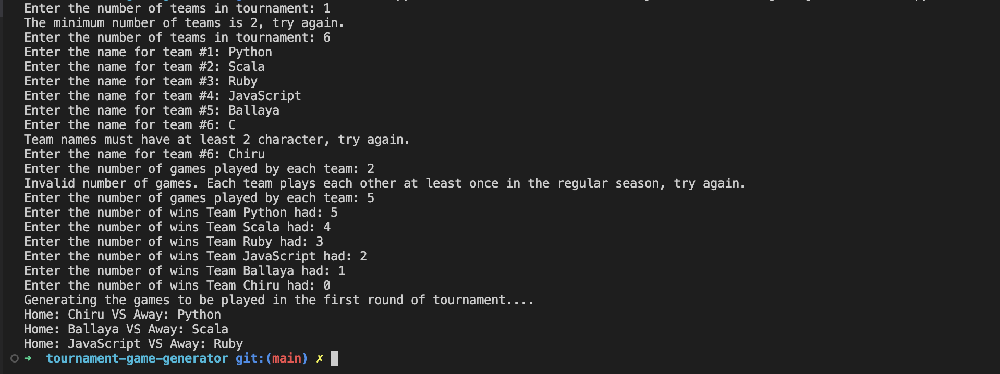

# Tournament Game Generator
A tournament game generator is a software tool that automates the process of scheduling and organizing competitive matches for various games. It is used to fix matches and ensure a fair tournament experience.

